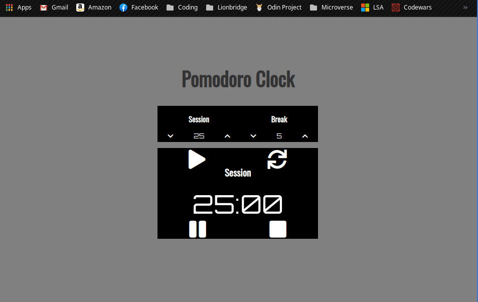

# Pomodoro Clock

> This is a basic Pomodoro Clock with adjustable Session and Break settings.

This project was built with Vanilla Javascript, using Time Objects, defining and implementing functions, and interacting with DOM elements. It integrates buttons functionality to interact with the clock and change time settings.

## Usage example

A Pomodoro clock is extremely useful when working because it allows you to take breaks when needed. Studies have shown that humans can not stay focused for over 25 minutes, so this tool will help you stay aware of when it is time to take a short break.

_For more examples and usage, please refer to this article on [Wikipedia](https://en.wikipedia.org/wiki/Pomodoro_Technique]._)

## Built With

- HTML
- CSS
- Javascript

## Live Demo

[Live Demo Link](https://rawcdn.githack.com/lmaldonadoch/pomodoro-clock/7a57176f42bd89409295b71e65254731564004b2/index.html)

## Getting Started

**Need web browser.**

To get a local copy up and running follow these simple example steps.

### Download Repository (https://github.com/lmaldonadoch/pomodoro-clock)

## Author

👤 **Luis Angel Maldonado**

- Github: [@lmaldonadoch](https://github.com/lmaldonadoch)

## 🤝 Contributing

Contributions, issues and feature requests are welcome!

Feel free to check the [issues page](https://github.com/lmaldonadoch/pomodoro-clock/issues).

## Show your support

Give a ⭐️ if you like this project!

## Acknowledgments

- This project is based in a project by [The Oddin Project](https://www.theodinproject.com)
